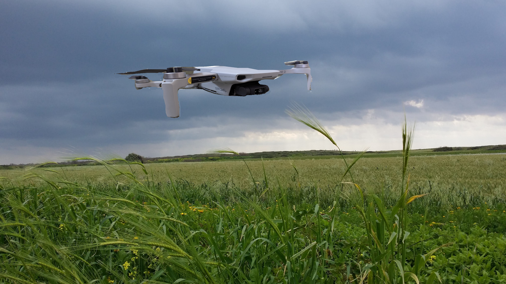
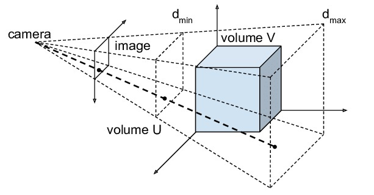
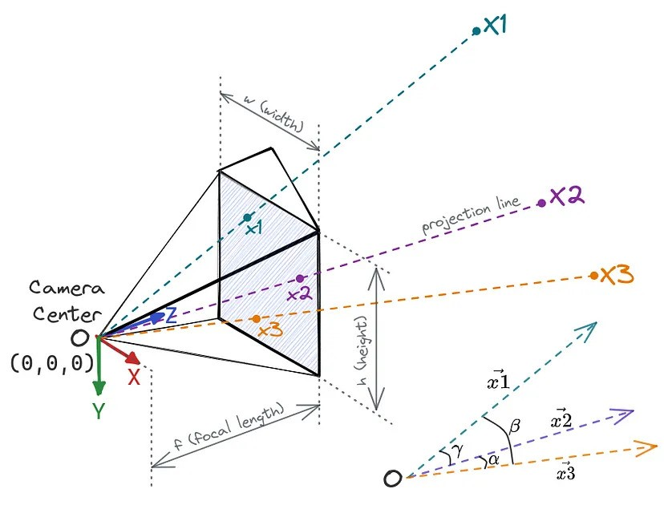

# Perspective Projection video (Perspective-n-Point)


This project aims to create a video that displays the PnP solution.<br/>
The best way I found to show the video, is to record it in the opposite order, and then by using CV2 I reverse it again



---


##Notes
- **Input data without the precise solution of the PnP** I didn't have the PnP solution therefore there are differences in the expected input of the 2D image and 3D points cloud:
 1. **loading files/get numpy array :** due to creating the 2D image and 3D
object, I load the files (which include a numpy array on them), and then I
convert it to Mesh and Points cloud - at the code, I explain how to load numpy arrays directly.

 2. **Perspective data:** I didn't have the data about the coordinates, angles, or resize scalar. I find a way to find them I call it calculation and I will expand that at *'calculate to find Perspective '* if you get the PnP solved don't substitute those variables <br/> <br/>
- **Examples** There are 2 examples in the code first MQ9 (on California) drone and the second DJI mini2 on a field
  1. **Data sources** all the stl files loaded from 'thingiverse.com'<br/>
https://www.thingiverse.com/<br/> The first example of MQ9 drone the jpg is downloaded from (https://www.dvidshub.net/image/3474102/mq-9-reaper-flies-over-southern-california)
For the second example of DJI mini2,  I created the jpg.
  2. **Running 2 examples at the code** the place at the code that need to be change for each example are:
    * scalar_resize (part 1)
    * path files (part 2)
    * coordinates (part 3)
    * video files name (parts 4-6)<br/>   
    you can see that in thos places there are notes with ##<br/>
you can swape the lines

```
path_2D_image = r"C:\Users\orelb\Convex_video\final_project_video\Test_MQ9\MQ9_California.jpg"      #change it to the relvent file
##path_2D_image = r"C:\Users\orelb\Convex_video\final_project_video\Test_MQ9\ProjectionVideo\DroneOnField.jpg"    #for DJI mini 2
```


---


#Prep calculation to get approximate pos coordinates:
While writing the code I create the 2D image and 3D object, I can't know exactly where the rays of the projection should be and at which size I should resize the 3D object, So I did a approximated calculation
- I seprate the image to areas due to the assuming I know where the object I want to project appear, I could know what is the prespective I need to substitute at axses:
  - x (width)
  - y (height)
  - z (f = focal length)



**The camera** is on (0,0,0) <br/>

**2D image** I want to put the middle of the 2D image parllel to the camera.<br/>
I found for each axses of the 2D image the total amout by
```
|x| = mesh_2D_image.bounds()[1]-mesh_2D_image.bounds()[0]
```
to get the 'final corrdinate' I multiply |x| * n
while n is the prespective of the width of the object at the image

```
image_2D_final_x_cordinate =  -0.5 * (mesh_2D_image.bounds()[1]-mesh_2D_image.bounds()[0])
# -0.5 = w
#negative value because we represent the rotation at the left side
```

I repaet this procsess for y (for height). <br/>
The z axses I can choose the size.<br/> I get the boundaries by
```
mesh_2D_image.boundaries()
```
**3D object** I put the y and z axses at 0, and the x = -'scalar_resize_3D_object' * 2D_image_z_coordinate

We get the scalar we multiply to get the 2D_image_coordinate by the place of the object at the image

explain about the code:
This code is seprate to 6 parts.<br/>
*   **Part 1-** import Libraries and resize scalars for 2D image and 3D object
*   **Part 2-** INPUT: only loading the 'numpy input' to vedo variables (2D image, points of 3D object and projection lines) - the posing and rotations will be at the next part
*   **Part 3-** INPUT: loading angles and coordinates (final coordinates for 2D image, 3D object and the angle the sould be rotate) - I should assume it's given for me but I 'calculate' it by the size of the 2D image and the 3D object.
*   **Part 4-** VIDEO: setting the video and start recording the video
*   **Part 5-** REVERSE the video
*   **Part 6-** SHOW the expected video

explain about the code
**2D Image** - I load jpg file and convert it to Image class and then convert to Mesh
I convert to Image class because vedo Image object get jpg, png, numpy array... and many other files (including the numpy array)
In that we combine the points to object (Mesh) and we can rotate it by a given a diffrent angles to each axses (instead of rotating my multiply a projection matrix for each point at the numpy array)
-maybe at the convert the Image class to Mesh I have to threshold it (there is method for it, but I didn't know what would be the correct size)

**3D object** - I load the file__ and combine the vertices (save on resize_3D_object) and convert the vertecs to a Mesh so it will be represent like a points (for the projection lines we will convert it to Points)

**Rays (projectors)** - I draw it between the 3D object (mesh) and the 'camera', I calculate the distance by __ but if I can get it as numpy array, I can convert it to Image or save it as another object and upload the Plotter.

**Center of the projection = given_point** - I also call it camera and drae a res sphere around him, It poses on (0,0,0)

**Coordinates** - There is coordinate data for the 2D image and a coordinate data for the 3D object, It represnt the where to pose the ___ points. calcualte by___

**Angles** - for each axses (the same input for the 2D image and 3D object)
